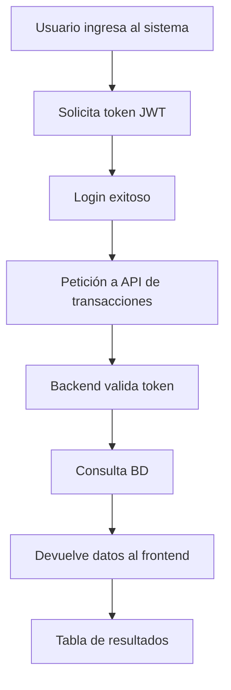
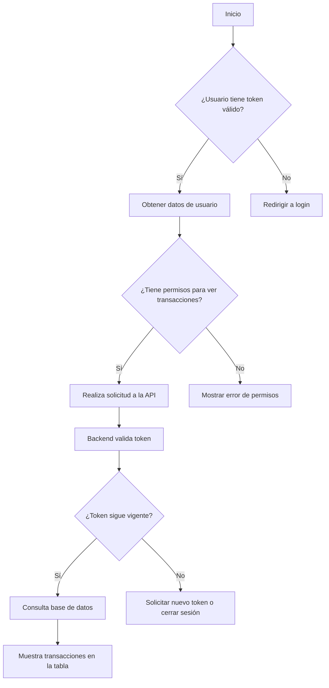
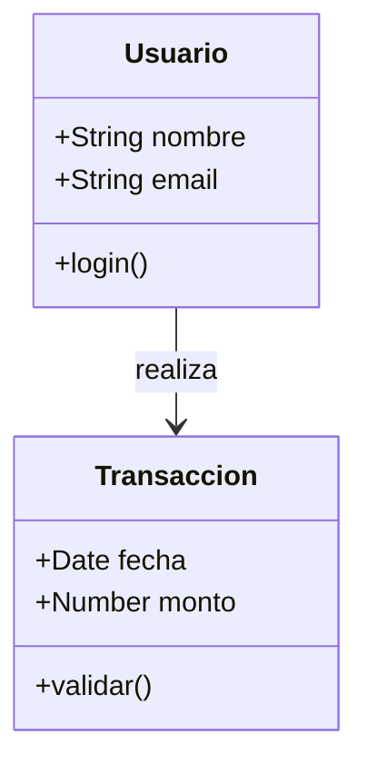
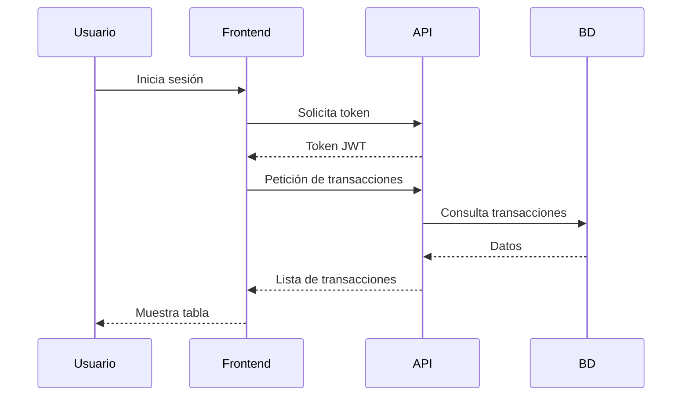
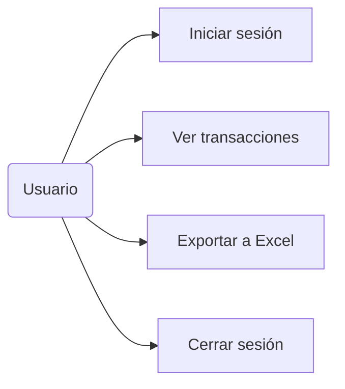
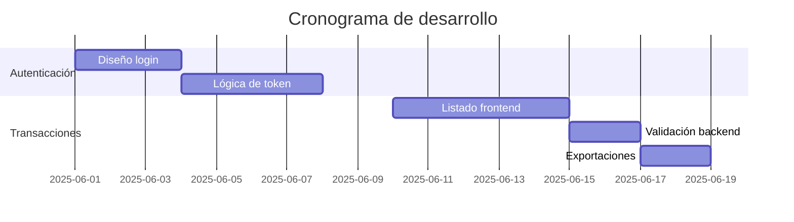
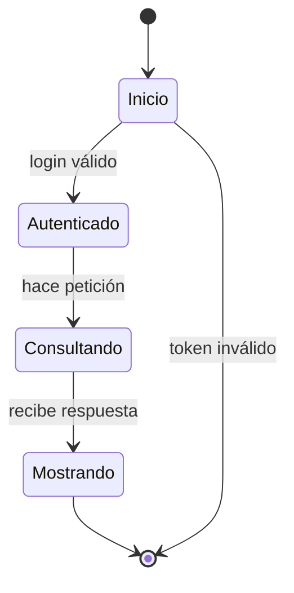
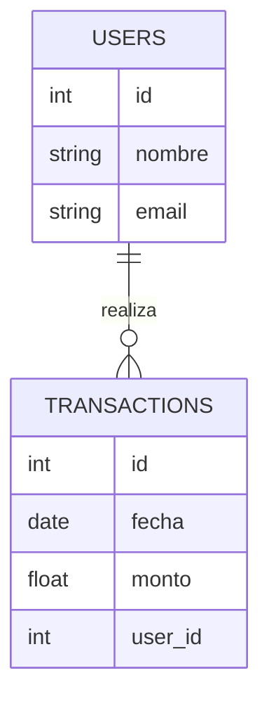

# 🔄 Diagrama de Flujos

 
 

# 1.- Flujo Secuencial Simple (graph TD)

Este es un flujo de pasos lineales que describe el proceso principal para consultar transacciones. Es útil para mostrar la secuencia directa de eventos sin condiciones.

 
 

# 2.- Flujo Condicional (flowchart TD con decisiones)

Este es un diagrama de flujo de decisión. A diferencia del anterior, este incluye condiciones lógicas, ideal para mostrar cómo se maneja el flujo ante errores o validaciones.

 
 

# 3.- Diagrama de Clases (classDiagram)

Este es un diagrama de clases orientado a objetos. Muestra la estructura de clases, atributos y métodos, y las relaciones entre ellas.

 
 

# 4.- Diagrama de Secuencia

Representa el intercambio de mensajes entre entidades a lo largo del tiempo.

 
 

# 5.- Diagrama de Casos de Uso (graph LR + estilo de actores)**

No existe un tipo `usecaseDiagram` en Mermaid, pero se puede simular con `graph LR` y etiquetas.

 
 

# 6.- Diagrama de Gantt (gantt)**

Ideal para mostrar cronogramas o planificación por tareas.

 
 

# 7.- Diagrama de Estado (stateDiagram-v2)**

Representa los estados por los que pasa un sistema, útil para máquinas de estado o validaciones.

 
 

# 8.- Diagrama de Entidad-Relación (erDiagram)**

Ideal para documentar esquemas de base de datos.

